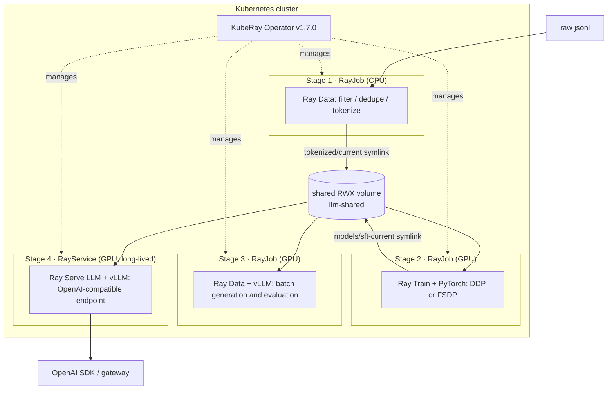

# A complete LLM pipeline on K8s + Ray + PyTorch + vLLM

On a single Kubernetes cluster, wire data processing, training, offline inference and
online serving into one chain, where every stage can be submitted and accepted on its
own and artifacts are handed off through one shared volume.

This repository is runnable, not illustrative pseudo-code. Every API and field was
checked on 2026-09-14 against the source / official samples of Ray 2.58.0 and
KubeRay v1.7.0, but it **has not yet been executed end to end on a real GPU cluster** —
see "How far this has actually been verified" at the end.

## 1. Start by pinning down who does what

The responsibilities of the four tools do not overlap, and confusing them is the most
common cause of rework in this pipeline.

| Layer | Component | Responsible for | Not responsible for |
| --- | --- | --- | --- |
| Resources | Kubernetes | which node a Pod lands on, quotas, GPU devices, network and storage | has no idea what an epoch or a KV cache is |
| Orchestration | KubeRay Operator | managing the lifecycle of Ray clusters through RayJob / RayService | no operator-level scheduling, nothing about model loading |
| Runtime | Ray (Core / Data / Train / Serve) | scheduling tasks and actors inside a cluster made of existing Pods, sharding data, organizing training workers, hosting service replicas | does not request nodes (that is K8s's job); a logical GPU quota is **not** GPU memory isolation |
| Compute | PyTorch | forward and backward passes, DDP/FSDP communication, the optimizer | nothing about where the data comes from or how replicas scale |
| Engine | vLLM | continuous batching, PagedAttention, KV cache, the OpenAI-compatible protocol | nothing about replica counts or traffic routing |

In one sentence: **K8s provides resources, KubeRay provides the Ray cluster, Ray
provides parallelism, PyTorch trains, vLLM infers.**

## 2. The pipeline at a glance



The key design decision: **artifacts are written under a per-run version, version
directories are created exclusively, and old versions are never overwritten.** The two
symlinks `data/tokenized/current` and `models/sft-current` are **a convenience entry
point for humans**, not a concurrency-safe data contract. The concrete guarantees and
their limits:

| Guarantee | How it is achieved |
| --- | --- |
| A rerun does not overwrite old artifacts | the version directory is created with `mkdir()` without `exist_ok`, so an existing one `raise`s immediately |
| Consumers see one consistent version | **the consumer calls `resolve()` once when the job starts** (stage 2's `resolve_data_version`, stage 3's `Path.resolve`) and then only uses the resolved result |
| What was evaluated and what went live are the same bytes | stage 3 writes the resolved version into `acceptance.json`, and stage 4's `model_source` names that same immutable version |
| Rollback is possible | old version directories are kept forever; rollback = set `model_source` back to the old version and apply |

**One important negative guarantee**: atomically replacing a symlink is **not a
snapshot**. It only guarantees that a reader sees either the complete old link or the
complete new link; it **does not guarantee that a series of subsequent opens all belong
to the same version**. So "atomic symlink switching" by itself cannot deliver "a running
training job will never have its data pulled out from under it" — that comes from the
consumer resolving once and pinning the result. An early version had only the former and
not the latter, which means it did not have this guarantee at all.

By the same logic, **stage 4's `model_source` must not point at a symlink**: weights
already loaded into GPU memory are not reloaded because a symlink on disk changed, and
changing it gets you "I thought I released it but I didn't" plus "old and new replicas
running side by side". A release is one explicit configuration change.

## 3. Version matrix

| Component | Version | Rationale |
| --- | --- | --- |
| KubeRay | v1.7.0 (chart 1.7.0) | the current latest release; `ray.io/v1alpha1` is marked deprecated, so this directory uses `ray.io/v1` throughout |
| Ray | 2.58.0 | the current latest release; Train V2 is on by default |
| Image | `rayproject/ray-llm:2.58.0-py312-cu130` | this tag is confirmed to exist. It bundles vLLM and transformers, and all four stages share the same image to reduce version drift |
| Kubernetes | ≥ 1.28 | needs a GPU device plugin or the GPU Operator |
| Base model | `Qwen/Qwen2.5-0.5B-Instruct` | publicly downloadable, trainable on a single GPU, used to get the pipeline running; see section 8 for scaling up |

The exact vLLM version is determined by the image — do not pin it separately. To check
it, exec into a Pod and run `pip show vllm`.

## 4. Prerequisites

```bash
# 1. GPUs are schedulable (you should see nvidia.com/gpu capacity)
kubectl get nodes -o custom-columns=NAME:.metadata.name,GPU:.status.capacity.'nvidia\.com/gpu'

# 2. There is a StorageClass that supports ReadWriteMany
kubectl get storageclass
```

- At least 2 GPUs (stage 2 uses 2 workers with 1 GPU each). With only 1 GPU, set both
  `NUM_WORKERS` and `replicas` to 1.
- You **must** change `storageClassName` in `00-platform/storage.yaml` from
  `REPLACE_WITH_RWX_STORAGE_CLASS` to the RWX class your cluster actually has
  (`efs-sc` on EKS, `standard-rwx` / Filestore CSI on GKE). See section 7 if you have no
  RWX. Do not change it to an empty string — in K8s an explicit
  `storageClassName: ""` means "use no StorageClass at all", which **disables** dynamic
  provisioning by the default class; the PVC can then only bind to a static PV that is
  likewise class-less, and otherwise stays Pending forever. (To use the default class you
  omit the field entirely, but the default class usually supports RWO only.)
- The namespace is hardcoded as `llm-pipeline` in the manifests, and the Makefile
  **does not offer** an override variable. This directory does not pull in a template
  engine, so the manifests' `namespace:` field cannot follow a Make variable; offering an
  override would only create the mismatch of "ConfigMap created in A, RayJob running in
  B". To change the namespace, edit the manifests or wrap them in your own kustomize
  layer.
- You only need an HF token to pull gated models:
  `kubectl -n llm-pipeline create secret generic hf-token --from-literal=hf_token="$HF_TOKEN"`

## 5. Running it end to end

```bash
make operator     # install the KubeRay Operator
make platform     # namespace + shared PVC
make data         # stage 1: data processing
make train        # stage 2: SFT training
make batch        # stage 3: offline batch inference
                  # ↓ before this step, replace the model_source in
                  #   rayservice-llm.yaml with the version stage 2 exported;
                  #   make serve will stop you on the placeholder
make serve        # stage 4: bring up the online service
make test         # acceptance: models / non-streaming / stream completeness / incremental delivery
```

The `make` targets for the three job stages all do the same thing: "delete the old
RayJob of the same name → apply → poll with `wait_rayjob.sh`".

**Do not use `kubectl wait --for=condition=Complete rayjob/...`**: KubeRay v1.7.0's
`RayJobStatus` has no `Conditions` field (only `jobStatus` / `jobDeploymentStatus`), so
that condition never appears and even a successful job waits until the timeout. And
`jobDeploymentStatus=Complete` is not a success signal either — `IsJobDeploymentTerminal`
returns true for both `Complete` and `Failed`. The real criterion is
`status.jobStatus == SUCCEEDED`.

### Stage 1 · Data processing (`10-data/`)

Ray Data's map/filter/groupby run in parallel on CPU workers: drop empty samples →
exact dedupe by content hash → **carve out a deterministic, disjoint holdout** → apply
the chat template and tokenize → **pad to a fixed length** → write parquet +
`eval.jsonl` + `manifest.json`.

Fixed-length padding is not laziness; it lets stage 2's `iter_torch_batches` assemble
rectangular tensors directly, with no custom collate_fn. In labels, both the prompt
segment and the padding segment are set to `-100`, so loss is computed only over the
answer.

Overlength samples have an explicit policy: **the prompt is never truncated**
(truncating it would break template consistency), **the answer may be truncated but eos
is always preserved**, and if the supervision budget is insufficient the whole sample is
discarded and counted. Without this, when the prompt fills `max_len` the labels are all
`-100`, and a whole batch with zero supervision turns cross entropy into `nan`, ruining
the weights with no error message.

**Acceptance check**: `data/tokenized/current/` contains parquet + `eval.jsonl` +
`manifest.json`, and `train_rows + eval_rows == deduped_rows`.

### Stage 2 · Training (`20-train/`)

`TorchTrainer` starts N workers (1 GPU each); `ray.train.torch.prepare_model` handles
device placement and the parallel wrapper, and `PARALLEL_STRATEGY` switches between
`ddp` and `fsdp`. At the end of each epoch the weights are saved in **HuggingFace
directory format** (`config.json` + safetensors + tokenizer), so vLLM can load it
directly as a `model_source` — no conversion script is needed between training and
inference.

Recovery goes through Train V2's `get_checkpoint()`, and **weights, optimizer state and
epoch are all loaded from the checkpoint**. Reading back only the epoch number while
leaving the model at the base weights silently discards the training already done, and
every metric still looks fine — worse than not recovering at all.

The `fsdp` branch applies when "the model fits on one GPU but cannot be trained there"
(0.5B–13B). `prepare_model` calls `model.to(device)` before wrapping in FSDP, so it is
not a switch for "training bigger models"; see
[training article §3.4](20-train/sft-training.en.md).

**Acceptance check**: loss decreases epoch over epoch and `skipped=0`;
`models/sft-current` points at the new directory, which contains `config.json`,
`*.safetensors` and `pipeline_provenance.json` (recording which data was used).

### Stage 3 · Offline batch inference (`30-batch/`)

`vLLMEngineProcessorConfig` + `build_processor` turn vLLM into a single Ray Data
operator. `concurrency` decides how many engine actors are started, and `batch_size`
decides how many rows go into each batch. There is no HTTP layer and no latency target;
the goal is throughput.

Change `preprocess` in the same code to "have the model generate answers for unlabeled
data" and you have data synthesis — which is exactly why "data processing" and
"inference" are the same set of operators on Ray.

At the start it `resolve()`s the `models/sft-current` and eval-set symlinks into
immutable versions and prints them, so "which version was evaluated" is on the record
and a mid-flight rerun cannot mix output from two models.

The end is an acceptance check that **will fail the job**: it checks across all rows
that `generated` is a non-empty string (not the "looks non-empty" kind like
`str(None)`), exits non-zero if the check fails, and writes the verdict into
`acceptance.json`. An "acceptance check" that only prints and never raises is no
acceptance check at all — downstream can start regardless.

**Acceptance check**: `acceptance.json` has `passed: true` and `rows_unusable: 0`, and
its `model_version` matches stage 2's `pipeline_provenance.json`.

### Stage 4 · Online serving (`40-serve/`)

The RayService's `import_path` points at Ray's own builder
`ray.serve.llm:build_openai_app`, and `args.llm_configs` is simply the `LLMConfig`
fields. Autoscaling goes by `target_ongoing_requests` (in-flight requests per replica)
rather than CPU utilization.

Two things must be turned on / written correctly: `enableInTreeAutoscaling: true`
(otherwise Serve gets no GPU worker when it scales replicas out, and `maxReplicas` is
decorative), and `model_source` naming the immutable version (otherwise changing the
symlink has no effect).

**Acceptance check**: all four checks in `make test` pass — models matches exactly,
non-streaming returns real content and a finish_reason, the stream is complete (has
content deltas + has `[DONE]` + no error + curl did not fail), and **incremental
delivery is judged by arrival time**. Counting SSE lines cannot detect buffering: a
proxy can buffer the complete response and then deliver all event lines at once.

## 6. Ten things that will actually block you

All of these were established from the source, not general-purpose "best practice"
advice. **Numbers ①③④⑤⑧⑨⑩ all really did occur in an early version of this
directory**; a round of technical review found each of them (the record is in
[REVIEW.md](REVIEW.md), all 13 findings reproduced and confirmed).

**⓪ `kubectl wait --for=condition=Complete rayjob/...` will never succeed.**
KubeRay v1.7.0's `RayJobStatus` has **no `Conditions` field**, so that condition does not
exist and even a successful job waits until the timeout. And
`jobDeploymentStatus=Complete` is not a success signal either
(`IsJobDeploymentTerminal` returns true for both `Complete` and `Failed`). The only
criterion is `status.jobStatus == SUCCEEDED`; see `wait_rayjob.sh`.

**① For a RayService worker's readiness probe, either write none or write all of it.**
KubeRay injects its combined probe only when the user has **not** declared a
`readinessProbe` (raylet health + Serve proxy `/-/healthz`, with `failureThreshold: 1`).
Write your own and omit `/-/healthz`, and the Pod enters Endpoints before the engine has
finished loading, so requests 5xx immediately. `40-serve/rayservice-llm.yaml` explicitly
reproduces that combination.

**② `/dev/shm` defaults to 64MB.** The PyTorch DataLoader, NCCL and vLLM's
inter-process communication all go through shared memory. Without an
`emptyDir: {medium: Memory}` mounted at `/dev/shm`, training hangs or hits a bus error,
and the error message points nowhere near the real cause.

**③ `NUM_WORKERS` must equal the total number of GPU workers.** Too few wastes GPUs;
too many leaves Ray Train waiting forever for workers, with the job stuck in
Initializing and no error.

**④ Under FSDP, `model.state_dict()` gives you a shard.** You must collect it inside an
`FSDP.state_dict_type(FULL_STATE_DICT, rank0_only=True)` context, and this is a
**collective communication** — every rank has to enter the call, and calling it only on
rank 0 hangs outright.

**⑤ In Ray Train V2, `TorchTrainer.restore` is deprecated.** 2.58 enables V2 by default
(`is_v2_enabled()` defaults to `True`). Material online, and some official examples,
still use the `can_restore` / `restore` form; under V2 that becomes
`resume_from_checkpoint` together with `ray.train.get_checkpoint()`.

**⑥ RayService's default upgrade strategy doubles your GPU requirement.**
`NewCluster` brings up a pending cluster first and cuts traffic over once it is ready.
When GPUs are tight the new cluster cannot start, and the service stays stuck on the old
version. As of v1.7.0, `NewClusterWithIncrementalUpgrade` is beta and enabled by
default, but it requires the Gateway API. Do not assume upgrades always need zero extra
GPUs.

**⑦ Configuring only Serve's `autoscaling_config` will not scale anything.** It only
decides the number of Serve replicas; adding Ray worker Pods needs
`enableInTreeAutoscaling: true`. Without it, `workerGroupSpecs.maxReplicas` is
decorative and replicas sit in PENDING — the symptom is "autoscaling is configured but
never scales".

**⑧ Resuming training must load the weights, not just the epoch number.** Skipping
epochs while the model stays at the base weights silently discards what you already
have, while the loss curve, the checkpoints and the job status all look normal. You must
`from_pretrained` from the checkpoint directory, and under FSDP the optimizer state has
to go through `FSDP.optim_state_dict()` / `optim_state_dict_to_load()` (also collective
operations).

**⑨ Under FSDP, gradient clipping must use `model.clip_grad_norm_()`.**
`torch.nn.utils.clip_grad_norm_` computes the norm of this rank's shard, and each rank
scales independently — nothing crashes or hangs, training stability just quietly gets
worse. Also, without an `auto_wrap_policy` FSDP has a single root unit, the forward pass
all-gathers every parameter at once, and the GPU memory saving is close to zero.

**⑩ `result.checkpoint` is the latest, not the best.** The Train V2 docs state plainly
that `checkpoint` = latest; for the best one use `get_best_checkpoint(metric, mode)`.
Configuring `checkpoint_score_attribute` and then exporting `result.checkpoint` is a
self-contradictory policy.

**Two deprecated/ineffective knobs**: `deploymentUnhealthySecondThreshold` and
`serviceUnhealthySecondThreshold` are marked "Deprecated: This field is not used
anymore" as of v1.7.0, so setting them does nothing. `storageClassName: ""` does not
mean "use the default class" but "use no class", and it disables dynamic provisioning.

**Two things about liveness / termination**: loading a large model can take minutes, so
the worker's liveness `failureThreshold × periodSeconds` must exceed the load time, or
the Pod gets restarted repeatedly mid-load and it looks like "the model is too big to
start". For a streaming service, `terminationGracePeriodSeconds` must exceed the p99
single-request generation time, or a rolling release cuts off connections that are
halfway through emitting tokens.

**One last item that is not in the code but matters just as much: the acceptance script
itself needs to be accepted.** The early smoke test in this directory would report
"all three checks passed" for a service that returned `{}`, had nothing but an error
event in the stream, and made curl exit on a timeout. A check that never fails is worse
than no check, because it gives false confidence. The current version has been
negatively validated against five fixtures.

## 7. What to do without an RWX volume

Switch to object storage; three replacements are enough, and you no longer need the PVC:

| Location | Change to |
| --- | --- |
| Stage 1 output | `write_parquet("s3://bucket/data/tokenized/v-<id>")` |
| Stage 2 `RunConfig` | `storage_path="s3://bucket/train"` |
| Stage 4 `model_source` | `{bucket_uri: "s3://bucket/models/sft-<id>"}` (the `CloudMirrorConfig` form) |

The cost is that you have no symlinks, so "the current version" has to be expressed
through an explicit version number or a pointer file, and the release process changes
accordingly to rewriting `bucket_uri` inside `serveConfigV2`. Ray Train explicitly
requires shared storage for multi-node training; a local path only works on a single
node.

## 8. Scaling from 0.5B to 7B / 70B

| Dimension | 0.5B (this directory's default) | 7B | 70B |
| --- | --- | --- | --- |
| Training parallelism | `PARALLEL_STRATEGY=ddp` | `fsdp` | `fsdp` + activation recomputation, consider DeepSpeed ZeRO-3 |
| GPU | 2 × 24GB | 8 × 80GB | multi-node, needs high-bandwidth interconnect |
| Inference `tensor_parallel_size` | 1 | 1 (80GB cards) or 2 | 4–8, plus a multi-host worker group with `numOfHosts` > 1 |
| Gang scheduling | not needed | recommended | required: plug in Kueue or Volcano so half a training group does not hold GPUs waiting for the other half |
| Load time | seconds | minutes | several minutes or more, so liveness thresholds must be raised to match |

When scaling up, the changes concentrate in three places: the workers' `resources` and
`replicas`, training's `PARALLEL_STRATEGY`, and inference's `tensor_parallel_size`. The
application code does not change — which is exactly the payoff of handing the
parallelism strategy to Ray + PyTorch instead of writing it yourself.

## 9. Where to hook up observability

- **Ray Dashboard**: `kubectl -n llm-pipeline port-forward svc/<head-svc> 8265:8265`,
  to see task/actor distribution, per-GPU utilization, and Serve replica status.
- **vLLM engine metrics**: you only get TTFT, queue depth and KV cache hit rate after
  turning on `LLMConfig.log_engine_metrics: true`. Autoscaling and capacity planning
  rely on this set of metrics, not on CPU utilization.
- **Layered troubleshooting order** (a failure must be verified layer by layer; you
  cannot look only at the outermost one):
  1. is the Pod Running and Ready (K8s layer);
  2. are all Ray nodes in the RayCluster registered (Ray layer);
  3. are the Serve application and replicas RUNNING (application layer);
  4. can the engine actually generate (`/v1/chat/completions`).
  Only when step 4 passes is the service "available"; all-green on the first three with
  step 4 failing is a common combination.

## 10. How far this has actually been verified

**API and field checks** (against pinned source, not paraphrased official docs):

- KubeRay v1.7.0's `ray.io/v1` RayJob / RayService fields, `upgradeStrategy` values,
  `autoscalerOptions` fields, `enableInTreeAutoscaling`;
- `RayJobStatus` has **no** `Conditions` field; the `RayServiceReady = "Ready"`
  condition **does exist** (so RayJob cannot use `kubectl wait --for=condition` while
  RayService can);
- `deploymentUnhealthySecondThreshold` / `serviceUnhealthySecondThreshold` are marked
  "Deprecated: This field is not used anymore";
- KubeRay's probe injection logic: a user-declared probe takes precedence; the
  RayService worker's combined probe (raylet + Serve proxy, `failureThreshold: 1`) is
  **injected only when none is declared** — the logic is the same in v1.4.2 and
  v1.7.0;
- Ray 2.58.0's `ray.data.llm` exports the name `build_processor` (`build_llm_processor`
  is no longer in `__all__`), and the `vLLMEngineProcessorConfig` fields;
- the `LLMConfig` / `ModelLoadingConfig` / `CloudMirrorConfig` fields of
  `ray.serve.llm`;
- Ray Train V2 is on by default (`is_v2_enabled()` defaults to `True`), `restore` /
  `can_restore` are deprecated, `Result.checkpoint` is the **latest** while
  `get_best_checkpoint(metric, mode)` is a separate thing, and `prepare_model`
  **calls `.to(device)` first and then wraps**, passing no `auto_wrap_policy` by
  default;
- torch 2.7's `FSDP.clip_grad_norm_` / `optim_state_dict` / `optim_state_dict_to_load`
  and `ModuleWrapPolicy`;
- the existence of the `rayproject/ray-llm:2.58.0-py312-cu130` image tag and of helm
  chart `1.7.0`.

**Checks actually executed locally** (no Ray, no GPU, no cluster):

- the four Ray CRs were validated with jsonschema against KubeRay v1.7.0's **real CRD
  schema**, and all are valid;
- `wait_rayjob.sh` behaves correctly on 6 status fixtures (including "deployment
  Complete but job FAILED must not be mistaken for success");
- `smoke_test.sh` behaves correctly on 5 fixtures (empty `{}`, error event, curl
  timeout, buffered stream, missing `[DONE]`, protocol frames only → all fail
  correctly; incremental arrival and complete → passes);
- `Tokenize._encode` was run on boundary cases with a synthetic tokenizer:
  zero-supervision samples are discarded, and for accepted samples eos is always the
  last token of the supervised segment (whether truncated or not);
- Python compilation, YAML parsing, the embedded YAML field inside `serveConfigV2`,
  Makefile parsing, and reachability of in-repo links.

**Not verified**: **this pipeline has never been executed on a real GPU cluster.** So
whether training converges, whether GPU memory suffices, how long loading takes, whether
the probe thresholds are appropriate, the real behavior of FSDP's state_dict / optimizer
state under a specific torch version, and the actual GPU-memory benefit of
`auto_wrap_policy` all need a first real run to confirm. After dedup, the demo data is
only 8 template samples (6 train / 2 eval), so a falling loss only proves the pipeline
works, not that the training is effective.

**Review record**: [REVIEW.md](REVIEW.md) is an independent technical review of this
directory; all 13 findings (7 of them P1) **were reproduced and confirmed** and have
been fixed, and the fixes were written back into the corresponding stage articles — "what
the early version got wrong, why it was wrong, and how it was changed" has its own
passage in all four articles, because those mistakes have more teaching value than
correct code does.

## 11. Layout and per-stage deep dives

Every stage has its own article explaining where it sits in the LLM lifecycle, what it
must accomplish, and **why the code and YAML are written the way they are** (including
alternatives and their costs). This document is the overview; the details are in the four
articles:

| Stage | Code and manifests | Deep-dive article |
| --- | --- | --- |
| 1 · Data processing | `10-data/` | [Turning raw text into fixed-length tensors the trainer can eat directly](10-data/data-processing.en.md) |
| 2 · SFT training | `20-train/` | [Turning fixed-length tensors into weights vLLM can load directly](20-train/sft-training.en.md) |
| 3 · Offline batch inference | `30-batch/` | [Treating vLLM as a data operator](30-batch/batch-inference.en.md) |
| 4 · Online serving | `40-serve/` | [Turning vLLM into an endpoint you can scale, upgrade and roll back](40-serve/online-serving.en.md) |

```
00-platform/    namespace, shared PVC, HF token example
10-data/        prepare_data.py + RayJob + deep dive     (stage 1)
20-train/       train_sft.py   + RayJob + deep dive     (stage 2)
30-batch/       batch_infer.py + RayJob + deep dive     (stage 3)
40-serve/       RayService + smoke_test.sh + deep dive  (stage 4)
Makefile        seven commands that string the pipeline together
wait_rayjob.sh  polls status.jobStatus for job completion (kubectl wait cannot be used)
REVIEW.md       independent technical review record; all 13 findings confirmed and fixed
```

Three threads run through all four articles, and it helps to read them side by side:

1. **Interface contracts**: each stage's artifacts are the next stage's direct input;
   there is no conversion script anywhere in the pipeline.
2. **Release pattern**: versioned artifact writes + atomic symlink switching + never
   overwriting old versions.
3. **Batch vs service semantics**: stages 1–3 are batch jobs (Burstable, destroyed when
   done, rerun on failure), and stage 4 is a long-lived service (Guaranteed, gated by
   probes, upgrades need a resource window).
4. **The KV cache's role flips from stage to stage**: stage 1 only constrains it
   indirectly through `MAX_LEN`, stage 2 explicitly **turns it off** (during training it
   is pure wasted GPU memory), stage 3 turns it up close to the limit as a matter of
   course, and in stage 4 it becomes **the entirety of capacity planning** — for the
   formula and measured numbers see
   [serving article §3.3](40-serve/online-serving.en.md).


Adjacent topics this repository does not cover: where Ray's responsibilities end and
Kubernetes' begin, the streaming semantics of a RayService zero-downtime upgrade, and
distributed training via Kubeflow Trainer — the last is an independent alternative to the
Ray Train route used here and is worth reading side by side.